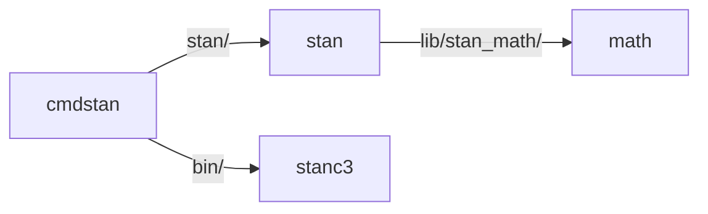
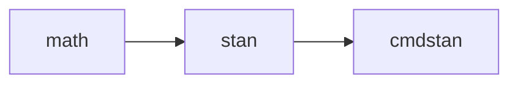

# Stan Continuous Integration

## Jenkins

Stan's primary CI platform is a Jenkins system kindly hosted by the Simons
Foundation at https://jenkins.flatironinstitute.org/job/CCM/job/Stan/

The following repositories are tested based on the pipelines specified in the
`Jenkinsfile`s in their top-level directories

- [stan-dev/math](https://github.com/stan-dev/math)
- [stan-dev/stan](https://github.com/stan-dev/stan)
- [stan-dev/cmdstan](https://github.com/stan-dev/cmdstan)
- [stan-dev/stanc3](https://github.com/stan-dev/stanc3)

The first three repostories depend on each other through git submodules,
with `cmdstan` including `stan` and `stan` including `math`. CmdStan uses
binaries built from the stanc3 source.

CI flows in the other direction. At the end of each pipeline,
they run the tests of the next repository up with the changes substituted.

Each of these downloads the `stanc3` binary from the most recent
[`nightly` tag](https://github.com/stan-dev/stanc3/releases/tag/nightly) of
`stan-dev/stanc3` when needed.

Jenkins utilities are housed in
[stan-dev/jenkins-shared-libraries](https://github.com/stan-dev/jenkins-shared-libraries/tree/main).
These Groovy functions are available to all the `Jenkinsfiles`. Additional
utility functions are provided by Flatiron and can be found at
https://github.com/flatironinstitute/jenkins-template/tree/main/vars.

### Test images

Our tests on Linux are completely containerized using Docker. The C++-based
tests use the [docker/ci](./docker/ci) image housed in this repository.

Windows and MacOS tests are not containerized and rely on some additional setup
outside the pipelines.

## Github Actions

Additional CI is done on Github Actions for smaller CI jobs. This repo itself
has a Github Action for [scraping release
notes](https://github.com/stan-dev/ci-scripts/actions/workflows/release-notes.yaml)
out of PR descriptions for the above repositories.

In any given repository, these files are in `.github/workflows/`.
